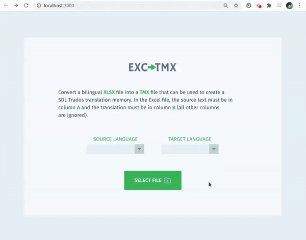

<h1 align="center">EXCtoTMX</h1>

This is the **backend** part for the simple project **EXCtoTMX** developed with **TypeScript** and **Node.js** (repo for the backend part <a href="https://github.com/edmundobiglia/exctotmx-frontend">here</a>). This minimal app converts a bilingual **.xlsx** file into a **TMX** file to be imported into translation software (CAT tools).

**TMX** is a type of XML file that contains translation units (source text and corresponding translations) that can be imported into **translation memories** (TMs) from translation software. A TM is a database of translations which is populated as translators translate source files.

## Motivation

Having worked as a translator for many years, I often found myself in a situation where I had an Excel file with existing translations that could be reused in another translation project, so I needed to generate a TMX file to import these existing translations into the translation editor and avoid having to re-type or copy and paste each translation unit.

## How it works

The TMX file is an XML file that follows a common structure, so this app basically allows you upload a bilingual .xlsx file (source text in column A and translations in column B), which is read and processed to generate the proper XML data.

The backend uses **Express**, **Multer** to handle the uploaded file, then uses the library **Excel.JS** to read the uploaded .xlsx file and map it to an array of `[source, translation]` tuples, which is in turn mapped to the proper XML translation units. The app then combines all translations units into one single big string containing the TMX data, which is sent to the frontend for download.

The backend also does some validation, returning an error as a response if some of the needed information is not included in the request or if the file is empty.

## Dependencies

The packages used for the backend were **Express**, **Multer**, **CORS**, **Excel.JS** and **XML Formatter**.
